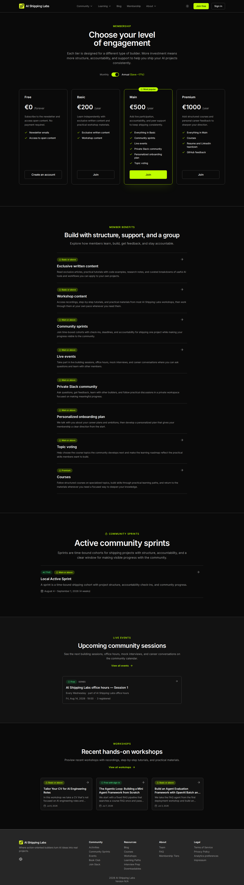
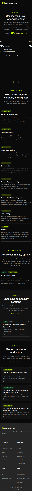
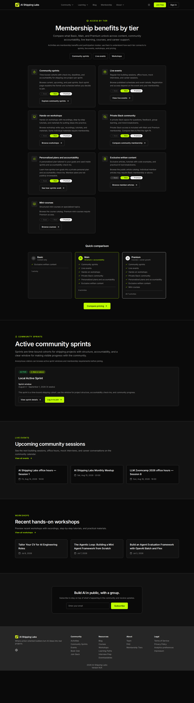

# Membership page UI/UX audit

Date: 2026-08-11  
Canonical surface: `/membership`  
Legacy redirects: `/pricing` -> `/membership`; `/activities` -> `/membership#activities`  
Related issue: #1402  
Reference: `_docs/design-system.md`

## Outcome

Pricing and Activities are now one Membership journey. Visitors compare plans
first, then read extended benefit explanations, then preview the real sprint,
event, and workshop experiences included in the offer. The page uses existing
site components rather than a separate visual language.

The earlier Activities page is retained only as an audited baseline:

## Findings and applied recommendations

### 1. Keep the decision and its evidence together

The former Pricing and Activities pages repeated tier information and forced a
visitor to move between two surfaces to understand one purchase decision.

Applied: the four existing plan cards remain the first and widest panel on
Membership. Detailed benefits immediately follow, so the visitor moves from
comparison to evidence without losing context.

Principles: task-oriented information architecture, proximity, and reduced
interaction cost.

### 2. Use one content record at two levels of detail

Plan bullets need to be short, while some benefits need enough copy to explain
their value. Maintaining those as unrelated template strings made drift likely.

Applied: every paid-tier benefit is a record in `tiers.yaml`. Its `title` is the
plan bullet and its optional `description` is the extended explanation. An
empty description intentionally creates a plan-only benefit. This is used for
Resume and LinkedIn teardown and GitHub feedback.

Principles: single source of truth, progressive disclosure, and consistency.

### 3. Make cumulative tiers explicit without repeating lists

Repeating every inherited benefit makes higher tiers harder to scan and
overstates small differences.

Applied: Main begins with `Everything in Basic`; Premium begins with
`Everything in Main`. Those inheritance lines are generated by the website and
are not repeated in plan descriptions.

Principles: comparison clarity, recognition over recall, and lower visual
noise.

### 4. Use width to express hierarchy

Uniform wide containers left short prose floating in empty space and gave
every section the same visual weight.

Applied:

- the established plan carousel remains `max-w-7xl`;
- benefit explanations are centered editorial rows at `max-w-3xl`;
- the single active sprint uses a centered `max-w-5xl` section;
- the single upcoming event uses a centered `max-w-3xl` section;
- recent workshops use a centered `max-w-5xl` three-card grid.

All section headings are center-aligned and the bordered bands provide a clear
vertical rhythm between decisions, explanations, and examples.

Principles: readable measure, visual hierarchy, grouping, and rhythm.

### 5. Reuse canonical component owners

The old Activities implementation assembled local variants of sprint, event,
and workshop cards, which made the surface look adjacent to the site rather
than part of it.

Applied:

- benefit rows use the shared editorial content-card owner;
- the active sprint uses the sprint body and badge partials from `/sprints`;
- the upcoming session uses the timeline listing card from `/events`;
- recent workshops use the compact cards from `/workshops`;
- the pricing panel keeps its existing shared tier-card geometry.

Principles: consistency, component ownership, predictable interaction, and
maintainability.

### 6. Keep the navigation label aligned with the destination

Activities no longer represents a standalone page after the merge.

Applied: Membership is a top-level navigation link and Activities was removed
from the Community dropdown on desktop and mobile. Old Activities URLs remain
safe permanent redirects for bookmarks and existing external links.

Principles: clear information scent, stable URLs, and minimal navigation
choice.

## Verification checklist

- `/membership` renders plans, benefits, sprint, event, and workshop sections
  in that order.
- `/pricing` permanently redirects to `/membership` and preserves its query
  string.
- `/activities` permanently redirects to `/membership#activities`.
- Community navigation has no Activities item on desktop or mobile.
- Main and Premium start with the correct generated inheritance bullet.
- Plan descriptions render in a stable three-line area without ellipsis.
- Benefits with empty descriptions appear only in the plan comparison.
- Only one current sprint and one upcoming event are previewed.
- Desktop and 390px mobile captures have no page-level horizontal overflow.
